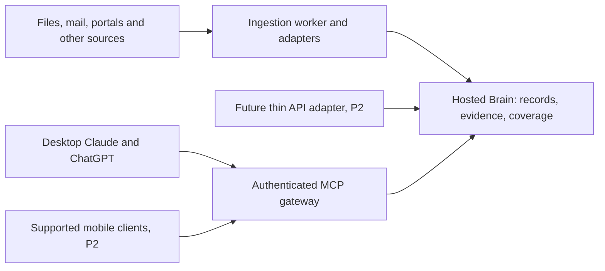

# Kith Mind: architecture and implementation direction

Date: 2026-09-06. Revised under R2-1 after the owner's review response.
Status: approved direction; implementation acceptance remains tracked separately.

Kith Mind is an owner-first knowledge system for life records. It maintains indexed evidence and structured records so a connected assistant can answer without fetching, OCRing, or re-importing the original source during an ordinary question. Medical records, finances, and household history are the priority. Desktop is the primary client. Native mobile integration is priority P2 and does not block useful desktop delivery. The deployed space, role, and scoped-credential architecture remains the foundation for later sharing.

This is the canonical technical design. The [Phase 1 plan](2026-09-06-phase1-brain-implementation.md) specifies the first implementation. The [review](2026-09-06-architecture-review.md) records the previous findings; its proposal to gate all work on mobile has been superseded. The [reuse assessment](2026-09-06-reuse-assessment.md) informs what we build versus integrate. Owner accounts, paths, and rollout notes remain private; they are not prerequisites for contributors.

## 1. Decisions and boundaries

| Topic                | Decision                                                                                                                                                        | Basis or remaining validation                                                                                                                                                                                                                               |
| -------------------- | --------------------------------------------------------------------------------------------------------------------------------------------------------------- | ----------------------------------------------------------------------------------------------------------------------------------------------------------------------------------------------------------------------------------------------------------- |
| Existing application | Retain the Convex store, Next.js gateway/UI, MCP and memory functionality while evaluating reusable components.                                                 | Working code reduces migration work. No claim that it is the only or best possible foundation.                                                                                                                                                              |
| Layering             | Brain query/write services; ingestion pipeline and adapters; worker scheduling and capture clients.                                                             | Services share versioned contracts and can be replaced independently. Transport must not contain a second set of business rules.                                                                                                                            |
| Lookup               | Hosted authenticated HTTPS endpoint and cloud-accessible indexed data.                                                                                          | Questions should remain answerable when the ingestion host and original source are unavailable.                                                                                                                                                             |
| Workers              | Start with one Mac worker for the owner's local sources. Cloud-source workers may run elsewhere.                                                                | One deployment recipe, not a universal Mac or whole-cloud-folder requirement.                                                                                                                                                                               |
| Family               | Keep the deployed shared-space, personal-space, role, and explicit source-routing controls. The first trial uses one owner-controlled space.                    | Family source onboarding and new sharing enhancements are deferred. Existing private records are never silently shared.                                                                                                                                     |
| Models               | Local extraction where measured quality is adequate; configurable cloud fallback. Hosted embeddings for the default deployment.                                 | Model names, dimensions, prompts and parser versions are recorded. Corpus quality and cost are measured, not asserted.                                                                                                                                      |
| Agents               | Deterministic code for enumeration, validation, identity, arithmetic and authorization. Agent runtime behind an adapter for tasks needing judgment or browsers. | Claude Agent SDK is an initial candidate, not a dependency of reading records or running ordinary ingestion.                                                                                                                                                |
| Reuse                | Reuse parsers, archives and memory components where they meet the contracts; avoid a wholesale replacement without a demonstrated advantage.                    | See the bounded comparison and component evaluation tasks. Copyleft is not a blanket reason to reject a useful separately operated application.                                                                                                             |
| Sharing the work     | Public code, synthetic examples, simple setup instructions and independent private deployments. MIT is the intended permissive license.                         | The owner reports that the upstream author authorized this fork and its continued development. Preserve attribution; plugin metadata alone is not treated as conclusive for a repository-wide MIT grant. No hosted service or app-store launch is required. |

Already implemented: account-scoped facts, entities, thoughts, lifecycle
history, hybrid recall, MCP gateway, authentication, web UI, family spaces and
roles, indexed documents and evidence, typed event records, the scoped
filesystem text worker, and its read-only doctor. The synthetic parser
evaluation is complete. Production parser integration, original-byte archives,
playbooks, cloud monitoring, portable restore, and automated connectors remain
planned until their tests pass.

### Owner-first trial

The first real-data trial is one owner, one explicitly selected source, and one
owner-controlled destination space. It requires the applicable archive,
parser, provenance, evidence, restore, and security gates. It does not require
new family-sharing features, multiple sources, family onboarding, or native
mobile support. Existing space isolation, role checks, scoped credentials, and
revocation behavior remain required regression controls; the trial does not
remove or weaken them. Expansion to additional sources or people requires its
own reviewed acceptance work.

## 2. Client and cloud contract

MCP returns useful text and structured JSON; a custom widget, local plugin, or desktop filesystem is never required to interpret an answer. Core operations are retrieval, exact record queries, source status, and explicit capture. OAuth discovery and token renewal are tested on supported desktop clients. Read credentials are separate from ingestion credentials. Future REST or GPT Actions adapters must use the same authorization and service functions.

The answer contract includes records and evidence, selected date semantics, coverage, last successful source update, partial-result flags, and original-source availability. A source link may need another account or device. Return the indexed evidence even then; do not expose a bearer download link to bypass the source owner's permissions. A cloud evidence viewer can check Brain membership and display the stored extract. Access to original bytes is a distinct permission and storage decision.

Native mobile is P2, not a Phase 1 gate. Current documentation describes Claude remote connectors on mobile and ChatGPT custom MCP as web-only. That is a dated compatibility finding, not a permanent architectural limitation. Try the hosted endpoint in each supported client after desktop works; consider an eligible GPT/API adapter only if a small prototype succeeds. Record app/account/version, read/write support, and OAuth renewal. Do not promise a new GPT is available to every account or build a separate native app to compensate by default. [Claude connectors](https://support.claude.com/en/articles/11176164-use-connectors-to-extend-claude-s-capabilities), [ChatGPT MCP availability](https://help.openai.com/en/articles/12584461), [GPT creation and API actions](https://help.openai.com/en/articles/8554397).

A connected server cannot observe an entire chat or force every model to call it. Test tool selection in fresh desktop conversations. Explicit “remember this” capture must return a saved record or a clear failure; ambient automatic capture is best effort. The Brain is shared external memory, not a promise of synchronizing the vendors' native memories.

## 3. Brain data and authorization

### 3.1 Family spaces and entities

`spaces`, `spaceMembers`, and space-scoped `entities` are in the first migration. `userId` remains the audit author of a fact or thought; it is not the ownership boundary for shared data. Canonical entity keys are unique within a space. Two family editors refer to the same child, vehicle or account. “Me” is resolved through the authenticated caller's explicit person link; an ambiguous identity produces a clarification rather than defaulting to the deployment owner.

An entity has no implicit access to a private counterpart. Phase 1 rejects cross-space content references. If explicit cross-space links are added later, each reference is checked at dereference time, and private labels, aliases or existence must not leak. Merges are explicit, reversible through history, and cannot be guessed from matching names. Basic family operations include create space, invite/accept, list members, change roles, remove members, and transfer ownership without removing the last owner.

| Role or credential          | Authority                                                                                                                                            |
| --------------------------- | ---------------------------------------------------------------------------------------------------------------------------------------------------- |
| Owner                       | Read/write, membership management, controlled space settings and ownership transfer.                                                                 |
| Editor                      | Read/write records in that space, including explicit correction of another member's shared record with actor audit. No membership administration.    |
| Reader                      | Read only. Cannot enqueue, correct, delete or change summaries.                                                                                      |
| Client or worker credential | Explicit allowed spaces and capabilities, intersected with current user membership. Connector credentials also bind their configured source account. |

Every read, history lookup, entity hydration, direct-ID request, count, export, query and write verifies the actual row's space and the operation. Client-supplied `spaces` can only narrow authority. Worker finalization rechecks authority after long-running work. An old signed identity must not retain removed membership or revoked credential authority. Cache keys and materialized summaries respect the same boundary.

Every write carries a destination space. If omitted, use a configured client/user default that is currently writable, otherwise the caller's personal space. An invalid configured default is an error. Never choose the first writable space or copy legacy private records to family automatically. Legacy records migrate to the author's personal space. Existing user-private lists/reports can remain private for now; derived family summaries must live in a space-aware table.

### 3.2 Source identity, revisions and evidence

Distinguish a logical source item, its immutable revisions, and derived extraction generations:

- `sourceItems`: space, connector, configured account, stable external ID, mutable provider location/URL, status, desired revision/processing epoch, and authoritative active revision/generation pointers. Canonical archived bytes belong only to immutable revisions. Identity is scoped by all four identity fields; URI or file path alone is insufficient.
- `sourceRevisions`: source item, trusted content hash, source timestamps, capture time, byte/text metadata and immutable archived content reference. Keep extracted pages/text independently of chunks.
- `documents`: a searchable representation of a revision/generation with document type and title. It has no independent current-version pointer; source-item active pointers determine visibility. Parser/extraction versions can change without manufacturing a new original revision.
- `documentPages` or equivalent bounded text objects: revision, page/section identifier, text and spans. Versioned parser output retains the text needed to resolve old citations.
- `evidence`: revision and extraction-text version plus page/cell/range/quote spans. Multiple spans may support one field. Phase 1 keeps source-scoped events separate unless a reliable shared identifier or explicit reviewed link establishes equivalence. Such links never cross authorization boundaries; general automatic cross-source consolidation is deferred.
- `chunks`: derived text and embedding with revision, processing generation, ordinal and evidence spans. Rebuilding a chunk index does not invalidate evidence identifiers.

Keep existing unstructured `sourceRef` for old conversational records. Do not invent historical file provenance. New ingested records require structured evidence; manually stated information records its author and observation time. Opaque source IDs are not secrets and confer no access.

Cloud provider IDs are preferred where stable; Dropbox IDs survive rename/move. For generic filesystem sources, maintain an identity manifest, reconcile rename candidates using metadata/hash, and leave ambiguous copies separate pending review. Root aliases make physical disk moves harmless but do not solve logical file identity. Sheets use stable sheet IDs and row keys where available; row positions and A1 links are mutable locations. [Dropbox file identity](https://www.dropbox.com/developers/reference/migration-guide).

### 3.3 Events, observations, facts and summaries

| Kind                  | Stored meaning                                                                                                                                              | Lifecycle                                                                                      |
| --------------------- | ----------------------------------------------------------------------------------------------------------------------------------------------------------- | ---------------------------------------------------------------------------------------------- |
| Event                 | Lab draw, medical encounter, service visit, financial transaction. Person/asset, source event ID or evidence-local key, occurrence date/time and precision. | Repeated events stay distinct; older imports do not replace newer events.                      |
| Observation/line item | Typed value attached to an event: analyte/value/unit, service work/odometer, fee/amount/currency.                                                           | Identity includes event plus field/item key. Equal values on different events remain separate. |
| Current fact          | Current address, provider preference, relationship or other state.                                                                                          | Explicit supersession/correction preserves history and evidence.                               |
| Summary               | Per-person or topic narrative derived from accessible active records.                                                                                       | Rebuildable, cited, marked stale when its dependencies change.                                 |

The event date, document issue date, capture date and ingestion date are distinct. Preserve timezone or date-only precision; unknown dates stay unknown. Use validated playbook schemas with a schema version. Money uses exact decimal representation or validated integer minor units plus currency, never floating-point accumulation. Keep raw measurement units and normalized values with conversion provenance. An absent value is not zero; an absent test is not a negative result.

Structured observations do not pass through conversational Smart Save admission/deduplication. Extracted current-fact candidates may use an adapted lifecycle path that preserves confidence and evidence; the existing hardcoded confidence of 1 is not acceptable for ingestion. Conflicting human and source claims coexist until explicit correction or a documented reconciliation rule applies. Backfill order must not decide truth. Duplicate statements and attachments link to one event only on a reliable shared identifier or reviewed match.

Workout capture is an optional future playbook for adopters. It is not an owner requirement, a Phase 1 deliverable, or a reason to build a fitness connector.

### 3.4 Query and coverage contract

MCP tools expose `search_documents`, `get_document`, `query_records`, `list_sources`, and explicit capture/ingestion. `query_fields` from the earlier draft is replaced by the typed `query_records` contract. Existing memory tools gain space filters, destination space on writes, and evidence/space labels on results.

`query_records` accepts allowlisted record kinds and fields, person/asset/account filters, occurrence-date range, sort order, limit/cursor, and supported operations such as list/latest/count/sum. Validation rejects arbitrary database expressions. Sum requires compatible currency/units and explicit grouping. Aggregations operate on the complete selected active records, using bounded resumable computation where necessary; never on a top-k semantic result. Return matched/contributing IDs or a paginated breakdown, coverage and exclusions. A limited/truncated result cannot be labeled a complete total.

Coverage is per configured source and relevant record type/date interval. Track discovered items, indexed items, failed/skipped/pending items, last successful enumeration, last successful processing, earliest/latest verified coverage and known gaps. A recent poll does not prove historical completeness. Completeness is scoped to the configured sources, record types and date range; it never proves that an event did not occur outside that archive. Only known coverage permits a strong negative statement about that defined scope. Otherwise say that no record was found in the available archive, state the gap, and offer the next source to check without silently fetching it.

Exact queries and keyword search continue when the embedding provider is down. Semantic search reports degradation. For arbitrary new questions, use stored text beyond predefined fields; original-source reprocessing is an explicit follow-up job.

## 4. Ingestion pipeline and reusable adapters

Stages: enumerate changes, durably enqueue, fetch/archive revision, extract text/pages, classify, extract schema-validated records and evidence, normalize/validate, stage generation, index, atomically activate. Host-specific extraction is an adapter boundary, not a promise that Apple frameworks, Python parsers and pure TypeScript all run inside Convex.

The source-contract comparison supports retaining Convex rather than adding GBrain plus a second authoritative records layer. Reuse GBrain protocol/export ideas when useful. Before writing OCR/table/layout code, evaluate Docling as the preferred parser adapter on representative documents; its documented capability is not a measured accuracy result. Before building archive management, evaluate an existing document archive's API. Use the same evidence, identity and permission contracts whether the source is a filesystem, an archive service, or a cloud API. Adapter packages can be separate processes where licenses or runtimes require that. Record pinned versions, attribution, runtime/model licenses and failure modes; do not copy an application's code into a permissively licensed core without checking its license.

Start with financial statements/receipts and a small synthetic lab/service corpus that exercises dates, repeated measurements and evidence. Financial, health and contract playbooks specify required fields, validation, field-level evidence and uncertain-value behavior. The software records medical/financial source data; summaries do not invent diagnoses or tax calculations unsupported by the indexed records.

Chunking is a measured retrieval choice. Preserve page/section boundaries where appropriate and support multi-span evidence for cross-page tables. Compare two or three strategies against labeled queries, including exact values, citations, negative cases and family isolation. Extend the existing fact/thought recall harness for documents. Re-chunk from stored text; re-run OCR only when the source or text extraction changes.

## 5. Jobs, cursors and operational recovery

### 5.1 Durable processing

`ingestJobs` is scoped to the source configuration and destination space. Compute a trusted content hash after fetch, or immediately for inline text. A client request ID handles pre-fetch retries; reusing it with different request content is a conflict. Source-revision uniqueness is `(sourceItemId, contentHash)`. Processing-generation uniqueness is `(revisionId, processingFingerprint)`, with the fingerprint including the source-text version. Reprocessing unchanged bytes reuses the source revision and creates a new derived generation only when its processing fingerprint changes. The same URI in two accounts or two destination spaces cannot collide.

Persist enumerated jobs and the next cursor in the same durable transaction, or acknowledge a cursor only after all associated jobs are durably admitted. A source's enumeration cursor is distinct from processing completion. Paginated enumeration resumes from the last committed page; retries may repeat delivery but cannot lose committed work.

Workers atomically claim a job with lease expiry and fencing token. Expired jobs are reclaimable. Heartbeat/renewal and completion must present the current token. Two overlapping polls or a stale worker cannot activate conflicting generations, even on one host. `host` affinity routes local-file work; it never substitutes for a lease.

Stage large text/record/chunk batches under a generation ID within platform limits. A final mutation checks completeness, source version, lease, current permission and validation, then advances `sourceItems.activeRevisionId` and `sourceItems.activeGenerationId` and completes the job. The job must still match the item's desired revision and processing epoch; an obsolete worker cannot replace a newer revision merely by finishing later. Inactive generations are available only through authorized history. Retrieval uses only active, validated generations. Old revisions remain auditable. Exact records, evidence and keyword text must be complete before activation. Embeddings have a separate `embeddingStatus` of pending, ready or failed; pending/failed embeddings do not hide validated exact records. Their idempotent retry fills the compatible index, and incomplete semantic results are labeled. Retries are bounded with backoff; exhausted jobs enter visible failure/review state.

### 5.2 Change, deletion and correction

| Trigger                                   | Required behavior                                                                                                                                                                                               |
| ----------------------------------------- | --------------------------------------------------------------------------------------------------------------------------------------------------------------------------------------------------------------- |
| Same source revision delivered again      | No duplicate active event or derived generation. Return only the caller's authorized job/result.                                                                                                                |
| Updated source                            | Stage replacement, validate, activate, mark dependent derived values superseded/stale, recompute affected summaries.                                                                                            |
| Corrected extraction with unchanged bytes | New processing generation and evidence-text version where needed; retain correction audit.                                                                                                                      |
| Deleted source                            | Mark unavailable; preserve archival evidence under the configured retention policy and label disappearance.                                                                                                     |
| Explicit forget                           | Authorized deletion workflow removes active and derived copies, queued payloads, indexes and caches; record a minimal non-content tombstone to prevent automatic resurrection. Document backup expiry behavior. |
| Failed replacement                        | Retain prior validated generation, label it stale, expose failure; never silently publish partial replacements.                                                                                                 |

### 5.3 Health and recovery

`watcherState` uses a stable authorized watcher ID scoped to its deployment/source/space, connector cursor version, last enumeration/processing times, coverage and errors. Config changes affecting source or destination require a migration or a new watcher identity. Expired or incompatible cursors trigger connector-specific full reconciliation. Gmail explicitly requires full sync for an out-of-range history ID. Polling is not an indefinite guarantee of catch-up. [Gmail synchronization](https://developers.google.com/workspace/gmail/api/guides/sync).

Cloud-side monitoring detects missing worker heartbeats and stale sources while the worker is off. Alerts are actionable and deduplicated: authentication expired, archive disconnected, queue stuck, coverage gap, budget paused, recovery failed. `brain doctor` checks configuration, identity, permissions, source reachability, worker heartbeat, generation/index compatibility and stale windows. It does not merely accept any HTTP 200 as proof of access to the configured corpus.

Before bulk ingestion, implement encrypted backups and test a restore into an isolated deployment. Include records, identities, memberships, provenance/text, processing versions, config and archived bytes or independently restorable references. Restore credentials through a separate secure procedure, disable workers until identities/source mappings are verified, and check counts/hashes plus sampled answers/citations. Define recovery point/time objectives from measured restore results. Adapt the existing upstream ai-brain exporter while preserving attribution and reviewing its contracts, rather than starting another generic exporter. Export schema-versioned JSON and an evidence manifest; Markdown is an optional readable projection, not the authoritative backup.

## 6. Sources and capture

| Source              | First implementation and constraints                                                                                                                                                                                                           |
| ------------------- | ---------------------------------------------------------------------------------------------------------------------------------------------------------------------------------------------------------------------------------------------- |
| Filesystem          | Allowlisted roots on the worker; synced files or archived exports. Events accelerate reconciliation. Detect placeholders, unreadable paths and moves. Only watched roots must be locally available.                                            |
| Document archive    | Adapter to an existing archive API if the parser/archive evaluation passes; do not build a competing document manager by default.                                                                                                              |
| Gmail               | Per-account grant, durable history cursor with resync, attachments with parent evidence and cross-source duplicate handling.                                                                                                                   |
| Google Sheets       | Watchlist, changed-file discovery, stable sheet IDs/row keys, snapshot/version evidence, deletions and recalculation handling verified by fixtures.                                                                                            |
| Health portals      | Prefer available structured exports; archive PDFs/text when needed. Verify actual export coverage and unattended sign-in per portal. Human sign-in or manual capture remains an acceptable exception path.                                     |
| GitHub              | Repository inventory and README, not source-code ingestion. Paginate with overlap and stable repo IDs; periodically reconcile deletions/access loss. Updated timestamps are a polling hint, not proof every change was observed.               |
| Granola             | Notes archive, transcripts off by default. Discover actual list/window/export support in a fixture-backed capability test. A bounded MCP listing does not establish permanent service deletion; keep export/backfill as explicit alternatives. |
| iMessage and Photos | Later OS-specific adapters, source identity must survive local database/library change where possible. A second host needs affinity plus leases.                                                                                               |
| Audio               | Later transcription adapter into ordinary sourced documents.                                                                                                                                                                                   |

Watchers are validated config: connector, account reference, stable watcher ID, destination space, scope allowlist, schedule and optional host affinity. Credentials stay outside YAML. Keep a source inventory with required scopes, cursor/recovery behavior, tested backfill limits and compatibility version.

Chrome capture remains the first optional capture surface: URL, selected/readable text and an archived snapshot where supported, with an explicit space selector. Test embedded viewers and portals rather than promising capture from every signed-in page. Desktop plugin hooks can suggest durable capture; do not silently assume all conversation content was saved. iOS Shortcut and native mobile-specific adapters remain optional P2 work.

## 7. Providers and evaluation

Keep `BRAIN_EMBED_ENDPOINT`, `BRAIN_EMBED_MODEL`, `BRAIN_EMBED_DIMENSIONS` and `BRAIN_EMBED_AUTH` as the embedding configuration family. Existing `text-embedding-3-small` at 1536 stays the initial baseline; `text-embedding-3-large` at 1536 is a candidate to compare before bulk ingestion, not an established winner for this corpus. Other tasks use separate configured model/provider settings. A setting alone does not make an incompatible provider/runtime interchangeable; each adapter must pass its request/response contract tests.

The embedding fingerprint includes provider/model revision, dimensions, normalization and relevant preprocessing. Query and indexed vectors must have matching fingerprints. Migrate through a staged generation with validation and atomic activation, or an explicit maintenance window with semantic retrieval disabled and exact fallback available. Never deploy new query embeddings while old document vectors remain active under the same index assumptions.

Local OCR, transcription and classification are recipe preferences subject to quality/memory/throughput checks. Do not publish unmeasured speed, quality or “best” claims. A cloud-hosted open-weight embedder is architecturally possible; the reason to avoid the home Mac at lookup time is availability, not the model's license or origin. Complete local-only deployment is deferred until store, identity, clients and model dependencies have been installed and tested together.

Measure field accuracy, missing-value detection, event deduplication, citation correctness, retrieval recall and question latency on a representative labeled pilot. Include a small synthetic suite in CI and keep personal evaluations local. Record total pages and actual OCR/model/retry costs. The earlier backfill budget is an owner-accepted order-of-magnitude estimate, not a guaranteed service price. Cap spend by source and day, pause visibly, and account for recurring storage and query costs separately.

## 8. Data handling and security

Cloud storage of indexed family data is accepted for the owner's deployment. Explain each path: source/archive storage; OCR/model provider inputs; Brain text, fields and vectors; snippets returned to the selected chat provider; logs and backups. Raw bytes may reach a parser or model only under that configured path. Do not claim raw files never leave the archive when an adapter can upload them.

Use API credentials for background processing and record actual retention controls. API keys alone do not establish zero retention; OpenAI documents prior approval requirements for those controls. Chat-client data handling is a separate setting/contract. [OpenAI data controls](https://developers.openai.com/api/docs/guides/your-data).

Worker/source credentials are narrowly scoped. Browser-agent credentials are separate from extraction workers. Tools, operations and outbound destinations are constrained in code; schema-valid text can still be false or malicious. URL fetches reject private network destinations, revalidate redirects and resolved addresses, and enforce size/time limits. Secrets stay in host credential stores or deployment secrets, outside config, public logs and exports. Do not put live patient, account or family examples in the public repo.

Basic authorization, injection boundaries, deletion and restore controls precede real-data backfill. Broader compliance certifications are outside scope; do not claim them. A compromised operator/host can expose its accessible records and credentials; least privilege limits rather than eliminates that risk.

## 9. Reproducibility

Publish the code and ordinary developer/install instructions as useful work lands. Contributors use the public plan and synthetic fixtures; the owner may keep a private tracker and deployment overlay. No contributor needs the owner's private folder, accounts, hardware or preferred agent subscription to run repository checks.

A default recipe can use hosted Convex/Next.js plus a Mac worker, with explicit costs and prerequisites. Cloud-source adapters can have a Linux/cloud worker recipe. Agent-assisted setup is supported, but the same ordered runbook should work for a person. Provider sign-ins, source sharing and OS permission prompts remain explicit setup steps. A complete install includes dependencies, configuration validation, service registration, credentials, source tests and a synthetic end-to-end query; writing a launchd plist alone is not installation.

A public contributor guide, accurate current-versus-planned README and upstream attribution are needed now. A polished installer, marketplace publication and commercial support are not requirements. The owner-reported permission to fork and continue removes a development blocker; verify upstream license scope before claiming the whole inherited project is permissively redistributable. A fresh git history does not change code provenance.

## 10. Phases and acceptance

Numbers preserve tracker references. Priority P2 for mobile is distinct from implementation Phase 2. The [Phase 2 implementation plan](2026-09-07-phase2-document-pipeline.md) defines the worker, parser, provenance, and restore sequence against the deployed Phase 1 contracts.

| Phase                | Deliverable                                                                                                                                  | Gate                                                                                            |
| -------------------- | -------------------------------------------------------------------------------------------------------------------------------------------- | ----------------------------------------------------------------------------------------------- |
| 0 / current revision | Reuse assessment, corrected public design and Phase 1 plan, contributor workflow                                                             | Approved review corrections reconciled; remaining external evidence gaps labeled.               |
| 1                    | Space entities/roles, family setup, typed records/evidence/coverage, durable jobs, exact queries and bounded text ingestion over desktop MCP | T8 and T12-T16 below on synthetic records; all repository checks; second-model security review. |
| 2                    | Reusable parser/archive evaluation, filesystem worker, financial playbooks, doctor/monitoring, export/restore, measured pilot then backfill  | T1-T3, T7, T17-T18; no bulk ingest before recovery and quality gates pass.                      |
| 3                    | Gmail and optional repository inventory                                                                                                      | T4 and T9; expired-cursor and reconciliation tests.                                             |
| 4                    | Health records/structured export and scan workflow, sheets, family source onboarding, cited health summaries                                 | T5-T6; coverage and repeated-lab tests on real supported sources.                               |
| 5                    | Chrome capture, optional session-save hook, meetings and messaging as needed                                                                 | T10 and actual owner capture use. iOS capture is optional.                                      |
| 6                    | Photo/audio indexing if useful                                                                                                               | Representative queries and privacy/identity review.                                             |
| 7                    | Refine the already-public recipe and test another person's installation                                                                      | T11. No requirement to launch a hosted service.                                                 |
| P2 mobile lane       | Test supported native clients and small adapters where available                                                                             | M1, independent of desktop phases and provider release timing.                                  |

| Test | Required result                                                                                                                                                                 |
| ---- | ------------------------------------------------------------------------------------------------------------------------------------------------------------------------------- |
| T1   | Financial fees over a selected covered period: deterministic amount/currency totals, statement breakdown, gaps and evidence.                                                    |
| T2   | Tax-record question: identify the supported source field(s), distinguish recorded from calculated amounts, state when the requested amount is not directly available.           |
| T3   | Contract clause question: quote stored text with correct immutable source revision and page/span.                                                                               |
| T4   | Last service: correct vehicle, event date, provider, cost and work, with receipt evidence.                                                                                      |
| T5   | Whether a family member has a recorded test: dated evidence or coverage-qualified no-record result, never an unsupported universal negative.                                    |
| T6   | Watched sheet: current indexed row/cell values plus snapshot date, identities and source link.                                                                                  |
| T7   | Offline worker and restart: durable catch-up/reconciliation without lost work or duplicate active observations.                                                                 |
| T8   | Family: same shared entities/records for members, reader write denial, private-space denial across every read/history/hydration path, revocation and default destination tests. |
| T9   | Repository inventory: answer from indexed records, state last scan and revoked/deleted sources.                                                                                 |
| T10  | Archived meeting: decision/commitment with cited note; retained indexed evidence remains readable independently of the source listing.                                          |
| T11  | Clean public checkout and recipe: another person installs with their own accounts; no private owner plans/data required.                                                        |
| T12  | Repeated equal lab measurements on different events remain distinct; out-of-order imports select newest by occurrence time.                                                     |
| T13  | Two accounts/spaces ingest identical URI/hash independently; repeated delivery within one source is idempotent.                                                                 |
| T14  | Exact/keyword retrieval works with embedding outage; mixed embedding generations cannot be queried as compatible.                                                               |
| T15  | Source correction/deletion/forget invalidates derived views appropriately; evidence and history obey authorization.                                                             |
| T16  | Desktop answers from stored evidence with worker and original source unavailable; original-link availability is separate.                                                       |
| T17  | Crash during stage/activation, overlap, lease expiry and cursor loss produce recoverable, observable outcomes.                                                                  |
| T18  | Restore/export preserves identity, permission boundaries, revisions and sampled answers/citations.                                                                              |
| M1   | Supported mobile client returns T16-equivalent answer under its own login; record provider limitation when unsupported. P2 only.                                                |

## 11. Deferred choices

Workout capture, a custom mobile app, photo face indexing, a dedicated graph database, a second worker host, alternative backing stores and a full local-only recipe are optional extensions. Evidence/record identities and query contracts must make those possible without requiring them now. Portal automation coverage, parser selection, extraction models and embedding-model changes are decided by the corresponding pilot, not by unverified rankings in a plan.

## Financial archive integration

A companion workstream in this repository builds a local financial archive of
holdings and transactions, acquired from institution adapters against documents
and exports a person has authenticated for themselves. The archive owns
canonical financial identity, deduplication and reconciliation; Kith Mind reads
it through a versioned scoped interface with exact values, stable IDs,
evidence, coverage and freshness, and does not build a competing authoritative
financial record set from the same statements. The institution adapter is the
reusable plugin point, and the same adapters feed both sides so there is one
ingestion path per institution. An optional hosted read projection is explicit
and preserves corrections and deletions. See the
[financial archive plan](2026-09-07-financial-transaction-database.md). This
work proceeds in parallel and does not delay the single-owner desktop document
trial.
